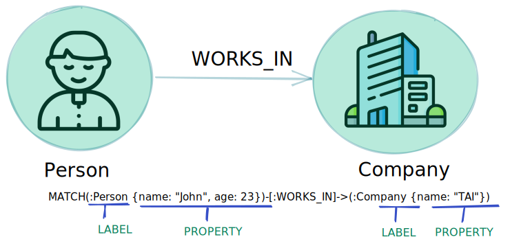
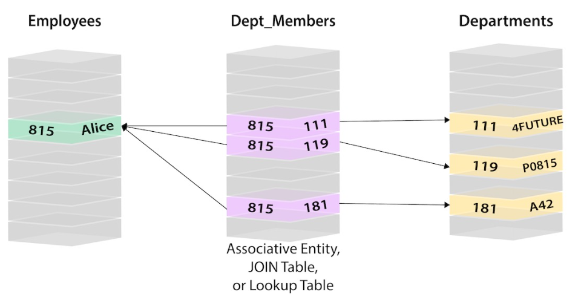
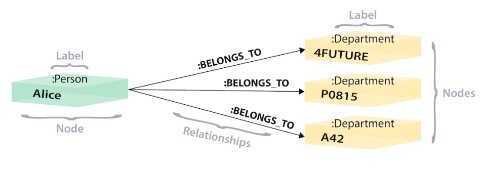
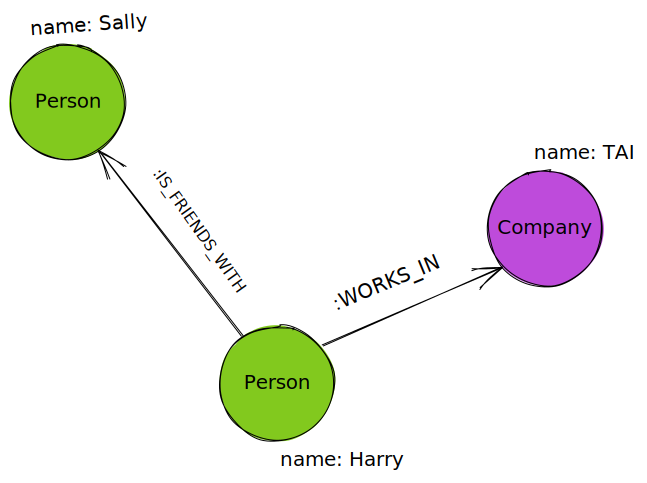
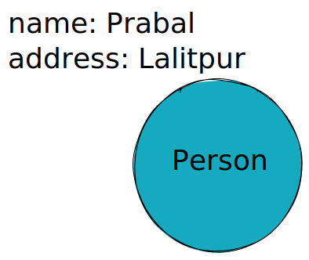
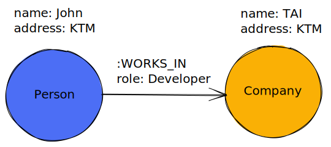

## Graph Database
- A graph database stores nodes and realtionships instead of tables, or documents. 




Nodes are entities in a graph. Labels are provided to the nodes to represent the different roles for the node. Nodes can hold any number of key-value paris , or properties (for exampe`{name: "John", age: 22}`)

Relation provide connection between two nodes. 
- Relation have a direction, a type (same as lables for the node), a `start node` and an `end node` . And they can have properties just like nodes
- A node can have multiple relationships with other nodes

## What is Neo4j?

Neo4j is a native graph database, which implements a true graph model all the way down to the storage level. The data is stored as you whiteboard it, instead of as a "graph abstraction" on top of another technology.

Neo4j is written in Java and Scala.

## RDBMS vs Neo4j

Reference link: https://neo4j.com/developer/graph-db-vs-rdbms/
In relational databases, reference to other rows and tables are indicated by referring to a primary key attributes via foreign key colums. Joins are computed at query time by matching primary and foreign keys of all rows in the connected tables. These operations are compute-heavy and memory-intensive.

When many-to-many relationships occur in the model, you must introduce a _JOIN_ table (or associative entity table) that holds foreign keys of both the participating tables, further increasing join operation costs.

The image below shows this concept of connecting a Person (from Person table) to a Department (in Department table) by creating a Person-Department join table that contains the ID of the person in one column and the ID of the associated department in the next column.



*Image soruce: Neo4j*

In the above relational example, we search the Person table on the left (potentially millions of rows) to find the user Alice and her person ID of 815. Then, we search the Person-Department table (middle table) to locate all the rows that reference Alice’s person ID (815). Once we retrieve the 3 relevant rows, we go to the Department table on the right to search for the actual values of the department IDs (111, 119, 181). Now we know that Alice is part of the 4Future, P0815, and A42 departments.

The same information can be stored using the Graph.




In the above graph version, we have a single node for Alice with a label of Person. Alice belongs to 3 different departments, so we create a node for each one and with a label of Department. To find out which departments Alice belongs to, we would search the graph for Alice’s node, then traverse all of the BELONGS_TO relationships from Alice to find the Department nodes she is connected to. That’s all we need - a single hop with no lookups involved.


## Introduction to Cypher

Referece link: https://neo4j.com/docs/getting-started/current/cypher-intro/
Cypher is a Neo4j's graph query language that lets you store and retrieve data to and  from the graph. It is like SQL for graphs. 
Cypher provides a visual way of matching patterns of relations, which makes queries both easy to read and write.

For example, you have a simple graph as shown in the image below. How would you represent it in English?



`Harry is friends with Sally. Harry works in TAI.`

### Representing nodes in Cypher

To represent a node in Cypher, we sourround the node with parentheses e.g `(node)`. Here, the parentheses look similar to the circles that  represents the nodes. 
![[nodes.excalidraw|600]]

### Node variables
In cypher we can refer to a node, we can give it a variable such as (p) for person or (t) for thing. We might want to use longer variables names such as (person) or (thing) to be more expressive.
If you do not want to use the node later in the query you can specify an anonymous node using empty parentheses ().

### Node labels
Labels are kind of tags and allows you to specify certain types of entities to look for or create. In our example, `Person` , and `Company`  are the labels.

The labels in Cypher are  similar to tables in SQL, you can tell SQL query to find a person's information from a Person or Employee or Customer table, similarly you can tell Cypher to only check those labels for that information.

Example of nodes in Cypher
```cypher
() //anonymous node (no label or variable) can refer to any node in the database 
(p:Person) //using variable p and label Person
(:Person) //no variable, label Person 
(work:Company) //using variable work and label Company
```

## Relationships in Cypher
To fully utilze the power of a graph database, we also need to express the realtionships between our nodes.
Realtionships in Cypher are represented using an arrow `-->` 
or `<--`  between two nodes.

Undirected realtionships are represented with no arrow and just two dashes `--`.
![[cypher_example.excalidraw]]

### Realtionship types
Just like how labels group nodes, realtionship types categorize and add meaning to a relationships. The realtionship types can be placed in a square brackets inside the arrow.

For example, lets look at the realtionship types from our graph.
- [: IS_FREINDS_WITH] - makes sens when we put with it (Harry IS_FRIENDS_WITH Sally)
- [ :WORKS_IN] - makes sense when nodes (Harry WORKS_IN TAI)

### Relationship variables
Just like with nodes, if we want to refer to a relationship later in querym we can give it a variable [] or [rel]. 

For example, you could use either `-[rel]->` or 
`-[rel:WORKS_IN]->` and call `rel` variable later in your query to reference the realtionship.

Examples:
```cypher
//data stored with this direction
CREATE (p:Person)-[:LIKES]->(t:Technology)

//query relationship backwards will not return results
MATCH (p:Person)<-[:LIKES]-(t:Technology)

//better to query with undirected relationship unless sure of direction
MATCH (p:Person)-[:LIKES]-(t:Technology)
```

### Node or realtionship properties

Properties are name-values pairs that provides additional details to our nodes and realtionships.

To represent the properties, we can use curly braces within the parenthesed of a node or the brackets of a relationships.
- Node property: (p:Person {name: 'Harry'})
- Realtionship property: -[rel:IS_FRIENDS_WITH {since: 2018}]
![[relation_prop.excalidraw | 600]]

## Patterns
Nodes and relationships can be considered as low-level building blocks. The real strength of the graph is its ability to encode patterns of connected nodes and relationships. 

A simple pattern, which has only a single relationship, connects a pair of nodes. For example, a Person `LIVES_IN` a City or a City is `PART_OF` a country.

```cypher
(:Person) -[:LIVES_IN]-> (:City) -[:PART_OF]-> (:Country)
```

###  Pattern syntax
We can express patterns by combining the syntax for nodes and relationships. 
Example:
```cypher
(kenau:Person:Actor {name: 'Keanu Reeves'})-[role:ACTED_IN {roles: ['Neo']}]->(movie:Movie {title: 'The Matrix'})
```

### Pattern variables
Cypher allows patterns to be assigned in variables , to increase the modularity and reduce repetition.
```cypher
acted_in = (:Person)-[:ACTED_IN]->(:Movie)
```
The `acted_in` variable would contain two nodes and the connecting realtionship for each path that was found or created.
### Creating and returning data
`CREATE` clause creates the patterns that you want to specify.

```cypher
CREATE (p:Person {name: "Prabal", address: "Lalitpur"})
RETURN (p)
```
The above cypher query creates one node, one label and two properties.
If you want to return the created data then you can add the `RETURN` clause, for example: RETURN (p) in the above query. It returns a node with label `Person` that we just created.



You can also create complex structures like :WORKS_IN relationship with the Company.

```cypher
CREATE (p:Person {name: "John", address: "KTM"}) -[r:WORKS_IN {role: "Developer"}]->(c:Company {name: "TAI", address: "KTM"})

RETURN p, r, c
```



### Matching patterns
Matching patterns is a task for the `MATCH` statement. You pass the same kind of patterns you have used so far to `MATCH` to describe what you are looking for.

To find all the nodes that have the label `Person`
```cypher
MATCH (m:Person)
RETURN m
```

You can also look for a specific person, like Prabal
```cypher
MATCH (p:Person {name: 'Prabal'})
RETURN p
```


You can also find more interesting connections, for example, the company in which *John* works and what his role is in the company.

```cypher
MATCH (p:Person {name: "John"}) -[r:WORKS_IN]->(c:Company)
RETURN c.name, r.role
```


References:
- [Graph DB vs RDBMS](https://neo4j.com/developer/graph-db-vs-rdbms/)
- [Introduction to Cypher](https://neo4j.com/docs/getting-started/current/cypher-intro/)
- [Patterns in Neo4j](https://neo4j.com/docs/getting-started/current/cypher-intro/patterns/)
